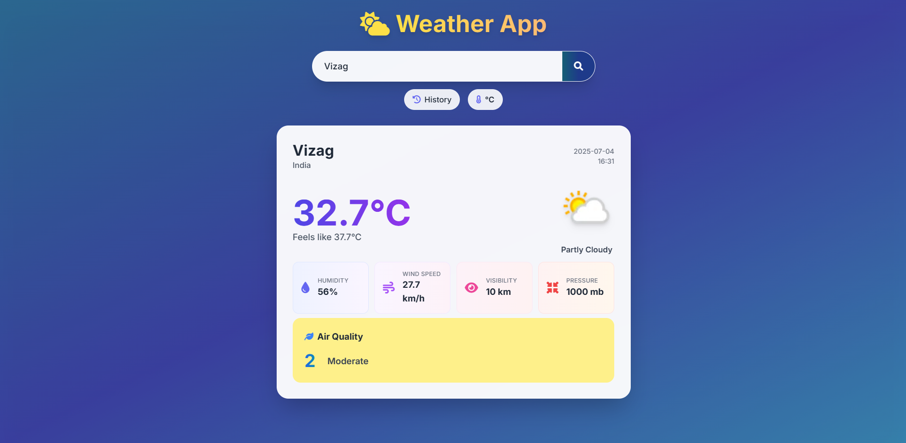

# ⛅ Beautiful Weather App

A modern, responsive weather app built with HTML, Tailwind CSS, and TypeScript. It instantly fetches real-time weather, air quality, and more for any city worldwide, featuring a beautiful blue-gradient glassmorphism UI with smooth animations, interactive search history, and a seamless user experience.



[](LICENSE)
[](https://developer.mozilla.org/en-US/docs/Web/HTML)
[](https://developer.mozilla.org/en-US/docs/Web/CSS)
[](https://www.typescriptlang.org/)
[](https://tailwindcss.com/)

[](https://fontawesome.com/)
[](https://git-scm.com/)
[](https://github.com/)
[](https://github.com/)

---

## ✨ Features

- **🌍 Global Read-Time Weather**: Get current weather, temperature, humidity, wind, pressure, and visibility for any city worldwide
- **🕑 Local Time**: Displays local date and time for the selected city
- **💧 Weather Details**: Humidity, wind speed, visibility, and pressure
- **🍃 Air Quality Index**: Live AQI with color-coded backgrounds and health labels
- **🕑 Search History**: Quick access to your recent city searches dropdown and easy removal.
- **🎨 Modern UI**: Elegant, glassy UI with animated transitions, glassmorphism, gradients, and smooth animations
- **📱 Fully Responsive**: Works beautifully on desktop, tablet, and mobile
- **🔄 Unit Toggle:** Instantly switch between Celsius and Fahrenheit.
- **⚡ Fast & Lightweight**: No frameworks or build tools required—just open and use! Minimal dependencies, instant results
- **🕘 Loading & Error Handling**: Animated loading spinner, dismissible error popups, and friendly error messages for invalid cities

## 🎮 Usage Guide

### Basic Controls

- **Search**: Enter a city name and click the search button or press Enter
- **Toggle Units**: Click the °C/°F button to switch temperature units
- **View History**: Click the History button to see recent searches
- **Select from History**: Click a city in the dropdown to reload its weather
- **Remove from History**: Click the × next to a city to remove it from history

### Error Handling
- If a city is not found, a friendly error popup will appear
- Click the close (×) button to dismiss error messages

## 🔧 Tech Stack

### **Technologies Used**
- **HTML5**: Semantic markup
- **Tailwind CSS**: Utility-first CSS framework via CDN
- **TypeScript**: Type-safe JavaScript for robust code
- **Font Awesome**: Icon library via CDN
- **WeatherAPI.com**: Real-time weather and air quality data
- **Git** – Version control
- **GitHub** – Code hosting and collaboration

## 🛠️ Getting Started

1. **Clone the repository:**
   ```bash
   git clone https://github.com/pvm-harshavardhan/weather-app.git
   ```
2. **Change to the project directory:**
   ```bash
   cd weather-app
   ```
3. **Compile TypeScript File:**
   ```bash
   tsc script.ts
   ```
4. **Open the app:**
   - Open `index.html` in your web browser.
5. **Start searching for weather!** ⛅

_No build step or server required!_

## 📁 Project Structure

```
weather-app/
├── 📄 index.html        # Main HTML file with Tailwind CDN
├── ⚡ script.ts         # TypeScript logic for weather, UI, and history
├── ⚡ script.js         # Compiled JavaScript output
├── 🖼️ favlogo.png       # App favicon
```

## 📱 Browser Compatibility

- ✅ Chrome (recommended)
- ✅ Firefox
- ✅ Safari
- ✅ Edge
- ⚠️ Internet Explorer (limited support)

## 🐛 Troubleshooting

### **Weather Not Loading?**
1. Check your internet connection
2. Ensure WeatherAPI key is valid and not rate-limited
3. Check browser console for errors
4. Verify file paths in the code

### **Styling Issues?**
1. Make sure Tailwind CSS CDN is accessible
2. Clear browser cache

### **Mobile Issues?**
1. The app is fully responsive
2. Touch controls work on mobile devices
3. Some mobile browsers may restrict auto-focus or popups

---

## 🖼️ Customization & Screenshots

- Replace `favlogo.png` with your own logo if desired
- Add screenshots or GIFs to highlight features and UI
- Update colors and styles in Tailwind config or HTML classes

---

## 🌐 Deployment

Deploy your Weather App easily using **GitHub Pages**, **Netlify**, or **Vercel** for free.

---

## 🤝 Contributing

Contributions are welcome!  
Feel free to open issues or submit pull requests to improve the app.

---

## 📄 License

This project is licensed under the **MIT License** - see the [LICENSE](LICENSE) file for details.

## 📞 Contact

Your Name - [@pvm_harsha](https://x.com/pvm_harsha)  
Project Link: [Weather App Web Project](https://github.com/pvm-harshavardhan/weather-app)

---

**Made with ❤️ by [Your Name]**

**Enjoy the weather! ⛅🌦️🌈** 